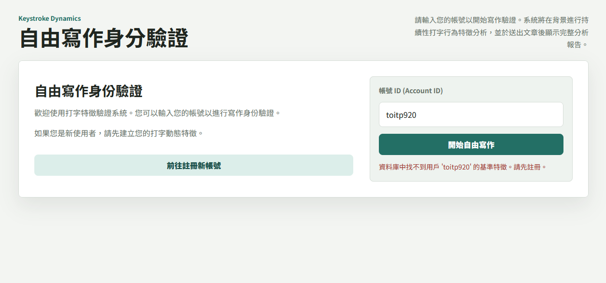
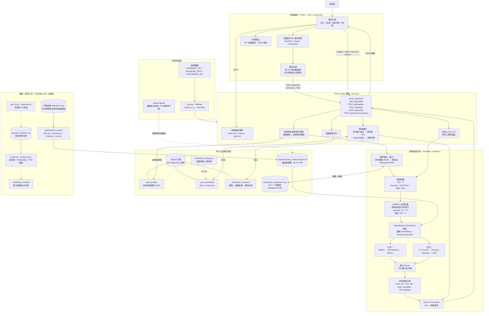
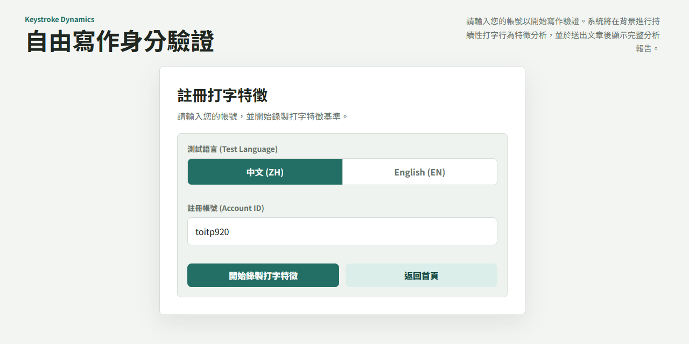
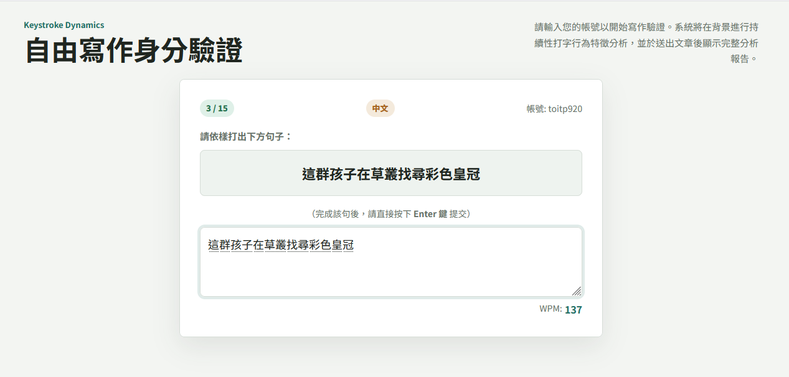
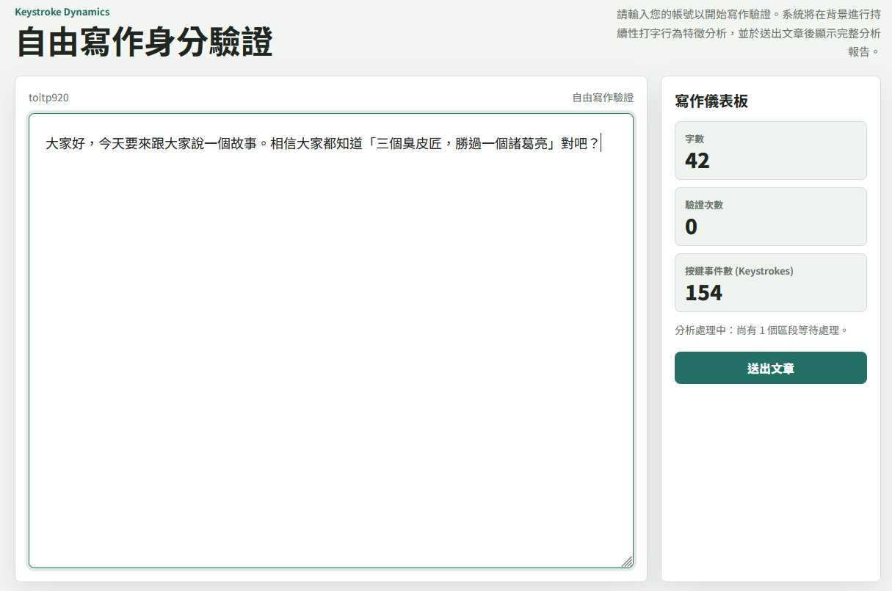
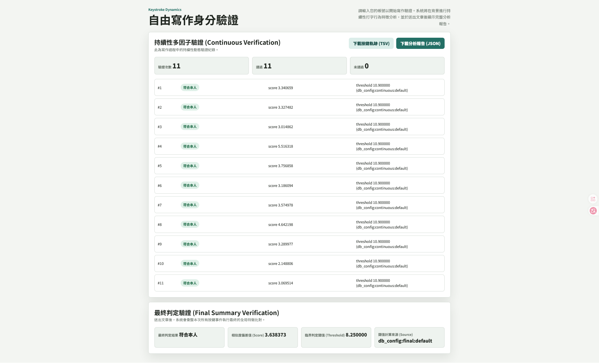

# 自由文字打字特徵註冊與寫作驗證系統 (Keystroke Dynamics Free-Text Verification & Registration System)

本專案是一個整合了**打字特徵註冊錄製**與**自由寫作身分驗證**的本機 Web 系統。系統利用深度學習技術，透過分析使用者自由打字時的微觀節奏（如按鍵按壓時間 Hold Time 以及按鍵間飛行時間 Flight Time），提煉出個人的打字行為特徵，並進行身分比對與連續驗證。

---

*系統主頁面預覽：*


---

## 聲明與引用

### 1. 學術論文引用
本專案的按鍵特徵提取與深度學習模型實作，基於以下學術論文的研究成果：

> **Type2Branch: Keystroke Biometrics based on a Dual-branch Architecture with Attention Mechanisms and Set2set Loss**
> *arXiv preprint arXiv:2405.01088, 2024.*
> 論文連結: [https://arxiv.org/abs/2405.01088](https://arxiv.org/abs/2405.01088)

### 2. 訓練資料集引用與聲明
本專案所加載之預訓練模型權重，其訓練資料集來自芬蘭阿爾托大學（Aalto University）發佈的開源按鍵動力學資料集 **136M Keystrokes Dataset**：

> **Observations on Typing from 136 Million Keystrokes**
> *In Proceedings of the 2018 CHI Conference on Human Factors in Computing Systems (CHI '18).*
> 資料集官網: [https://userinterfaces.aalto.fi/136Mkeystrokes/](https://userinterfaces.aalto.fi/136Mkeystrokes/)
>
> 根據該資料集授權規範，此數據免費使用於非商業研究與科學用途，在此對其作者團隊表示感謝。學術 BibTeX 引用格式如下：
> ```bibtex
> @inproceedings{dhakal2018observations,
>   author = {Dhakal, Vivek and Feit, Anna and Kristensson, Per Ola and Oulasvirta, Antti},
>   booktitle = {Proceedings of the 2018 CHI Conference on Human Factors in Computing Systems (CHI '18)},
>   title = {{Observations on Typing from 136 Million Keystrokes}},
>   year = {2018},
>   publisher = {ACM},
>   doi = {https://doi.org/10.1145/3173574.3174220}
> }
> ```

### 3. 開源授權
本專案包含基於上述論文的開源推論模型演算法。本專案整體採用 **GNU GPL v3.0** 授權條款。完整授權條款請參閱本專案根目錄下的 [LICENSE](file:///LICENSE) 檔案。

---

## 📐 系統設計與架構圖

本專案的系統設計與資料流向如下圖所示（此圖表可直接在支援 Markdown 渲染的平台如 GitHub、VS Code 中預覽）：



---

## 專案結構

本專案目錄結構設計如下：

*   `type2branch_model/`：存放深度學習模型推論與設定的 Python 模組（原為論文模型實作）。
*   `baseline_profiles/`：存放已註冊使用者的原始打字特徵基底檔案（格式為 `.tsv`）。*（Git 預設忽略其內數據，僅保留目錄結構）*
*   `processed_baselines/`：存放經前處理後的特徵快取檔案（格式為 `.npy`）。系統啟動時若發現快取不存在，會自動根據原始基底檔案重新生成。*（Git 預設忽略）*
*   `verification_results/`：存放每次寫作驗證的實驗結果報告與原始按鍵紀錄（包括 `.json` 與 `.tsv` 檔案）。*（Git 預設忽略）*
*   `server.py`：本專案的 Web 伺服器入口（基於 Python 內建 HTTP 服務），提供 API 路由（包括特徵註冊與寫作驗證）。
*   `keystroke_verifier.py`：負責按鍵特徵提取、特徵前處理、載入神經網路模型並計算相似度偏差值之核心引擎。
*   `index.html`：前端介面，包含「註冊新帳號」與「開始寫作驗證」雙重功能。
*   `app.js`：前端核心邏輯，包含即時打字事件監聽（鍵碼、IME輸入法事件、WPM打字速度計算）與 API 串接。
*   `style.css`：網站精美樣式表。
*   `10persentData_model.weights.h5`：預先訓練好的神經網路模型權重檔案。
*   `threshold_config.json`：存放不同使用者判定閾值的設定檔。
*   `requirements.txt`：專案所需的 Python 套件清單。
*   `Dockerfile`：用於容器化部署的 Docker 設定檔。
*   `.gitignore`：Git 忽略規則，防止個人特徵數據與驗證結果被上傳至公開倉庫。

---

## 環境配置

請確保您的電腦上已安裝 [Anaconda](https://www.anaconda.com/) 或 [Miniconda](https://docs.conda.io/en/latest/miniconda.html)。

### 1. 建立 Conda 虛擬環境
開啟終端機（或 Anaconda Prompt），切換至專案根目錄，並執行以下指令建立 Python 3.11 環境：

```bash
conda create -n kd_web python=3.11 -y
```

### 2. 啟動環境與安裝依賴套件
```bash
conda activate kd_web
python -m pip install --upgrade pip
pip install -r requirements.txt
```

---

## 運行與測試

### 1. 快速測試模型載入
在啟動 Web 伺服器前，您可以先執行測試指令，確認前處理模組與 TensorFlow 模型權重是否能順利載入。

```bash
# 測試特定帳號的 Embedding 計算
python keystroke_verifier.py --user user_01 --embed
```
*如果看到輸出 `embeddings: (...)`，即代表模型與權重已成功加載。*

### 2. 啟動 Web 伺服器
```bash
python server.py --host 127.0.0.1 --port 8000
```
啟動成功後，您會看到以下訊息：
```text
Keystroke verifier running at http://127.0.0.1:8000
Press Ctrl+C to stop.
```

### 3. 開啟瀏覽器使用
開啟瀏覽器（建議使用 Google Chrome）並前往 `http://127.0.0.1:8000/`。

---

## 系統使用流程

### 1. 註冊新帳號打字特徵
1. 在主頁點擊「**開始註冊新帳號**」切換至註冊頁面。
2. 輸入您欲註冊的 **帳號 ID**（例如 `user_01`），並在下方文字方塊中進行一段自由寫作。
3. 系統會記錄您的按鍵特徵（需收集足夠數量的有效打字事件，約幾百個按鍵）。
4. 寫作完成後，點擊「**提交註冊特徵**」，系統會將原始特徵檔案儲存至 `baseline_profiles/` 目錄下。

*系統註冊與按鍵記錄畫面：*

*註冊過程中的實時按鍵紀錄與進度條：*


### 2. 進行寫作身分驗證
1. 進入主網頁，輸入您已註冊的 **帳號 ID**。
2. 點擊「**開始自由寫作**」，系統會驗證該帳號 ID 是否存在並進入寫作介面。
3. 寫作過程中，系統會每收集 100 筆有效按鍵數據，在背景自動向伺服器發送比對請求，進行**連續驗證**。
4. 自由寫作完畢後，點擊「**送出文章**」，系統會顯示**最終總結驗證**與連續驗證的完整判定報告（判定指標包括相似度偏差值、符合本人、或特徵異常等狀態）。
5. 每次驗證的詳細結果與原始打字軌跡將會寫入至 `verification_results/` 目錄。

*自由寫作身分驗證頁面：*

*寫作完成後的驗證分析結果（包含相似度分數、連續驗證軌跡與判定結果）：*


---

## 判定閾值調整

您可以透過修改 [threshold_config.json](file:///threshold_config.json) 調整每位使用者的判定靈敏度：

```json
{
  "users": {
    "user_01": {
      "ZH": {
        "final": 8.25,
        "continuous": 10.9
      }
    }
  }
}
```
*   `final`：最後送出文章時的總結驗證閾值。
*   `continuous`：背景每 100 筆按鍵特徵進行連續驗證時的閾值。
*   *相似度偏差值小於該閾值時，系統將判定為「符合本人」；大於該閾值則判定為「特徵異常」。修改後請重啟伺服器以套用變更。*

---

## ☁️ 雲端與容器化部署 (Docker & Railway & Neon DB)

本專案支援無狀態（Stateless）容器化部署，特別適合部署於 Railway 或 Heroku 等雲端平台，並對接 Neon 等雲端 PostgreSQL 資料庫，解決免費雲端平台不支援本地磁碟掛載（Volume）的問題。

### 1. 雙資料庫切換機制
後端伺服器在啟動時會自動檢測環境變數：
*   **本機開發環境**：當無設定 `DATABASE_URL` 時，自動啟用 SQLite 本地資料庫模式，數據將寫入 `keystroke_dynamics.db`。
*   **雲端生產環境**：當環境變數中存在 `DATABASE_URL`（例如對接 Neon PostgreSQL）時，後端會自動切換為 PostgreSQL 資料庫模式，所有特徵基準、判定閾值、歷史寫作驗證紀錄直接寫入雲端資料庫。此時容器達成完全的「無狀態（Stateless）」，不需擔心容器重啟導致數據丟失。

### 2. 自動模型權重防護機制
由於雲端部署平台在從 GitHub 拉取專案時預設不會拉取完整 Git LFS 大檔案，導致 `.h5` 模型僅為 130 bytes 的文字指標。
本專案的 `server.py` 設有自動修復機制：**伺服器啟動時，若偵測到模型權重檔案不存在或小於 1MB，會自動從 GitHub LFS 直鏈（或指定的外部直鏈）下載 227MB 的真實模型數據並覆蓋**，確保服務啟動後即可直接載入模型。

### 3. 使用 Docker 本地部署
您可以在本機透過 Docker 進行打包與測試：
```bash
# 1. 構建 Docker 映像檔
docker build -t keystroke-verifier .

# 2. 啟動容器 (預設使用本地 SQLite)
docker run -d -p 8000:8000 keystroke-verifier
```

### 4. 部署至 Railway 的配置步驟
1. 在 Railway 上新增一個服務，並連結您的 GitHub 倉庫。
2. 在 Railway 上新增一個 PostgreSQL 數據庫（或是連接到 Neon DB），取得連線字串後將其設定為該服務的環境變數：
   *   `DATABASE_URL`：設定為您資料庫的 PostgreSQL 連線網址。
3. Railway 會根據根目錄的 `Dockerfile` 自動完成構建與啟動。
4. 啟動日誌中會出現 `[!] 偵測到模型權重檔案不存在或為 Git LFS 指標檔案...`，這代表正在自動下載真實權重檔案，請耐心等待其下載完成（顯示 `[+] 成功下載並取代模型權重！`），隨後即可直接存取您的 Public 網址。

