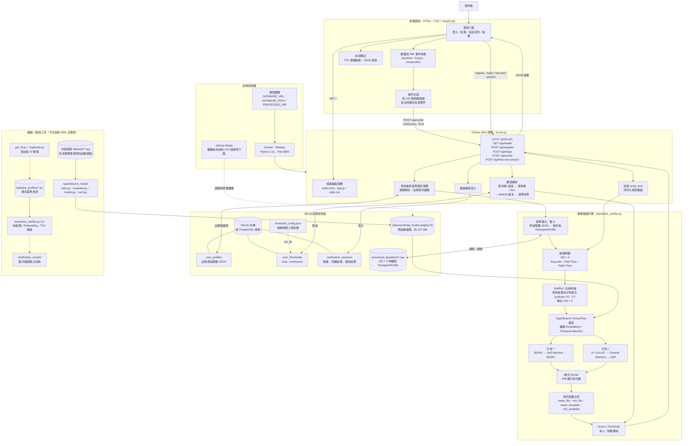

# 系統架構圖

本圖以目前程式碼的實際執行路徑為準，並將不在 Web 主流程內的訓練、CLI 與資料整理工具另外標示。

## 關鍵資料流

1. **註冊**：使用者完成 15 段指定句子，瀏覽器記錄按壓／放開時間、鍵碼及中文 IME 狀態，透過 `/api/register` 寫入 `user_profiles`，並清除該使用者的舊 `.npy` 快取。
2. **登入**：`/api/login` 從資料庫讀取註冊擊鍵；若快取不存在，建立使用者專屬 `HistogramProfile` 與 `(N, 100, 5)` 特徵快取。
3. **持續驗證**：自由寫作每累積 100 筆有效擊鍵，前端呼叫 `/api/verify`；後端產生 256 維向量，和基準向量計算歐氏距離並套用 `continuous_threshold`。
4. **最終驗證**：送出文章時，前端把全部事件依 100 筆重切，使用 `final_threshold` 驗證，再由 `/api/free-text-session` 將整次結果寫入 `verification_sessions`。

## 實作邊界與現況

- Web 主流程以 `user_profiles`、`user_thresholds`、`verification_sessions` 三張資料表為持久化核心；`DATABASE_URL` 存在時使用 PostgreSQL，否則使用 SQLite。
- `baseline_profiles/*.tsv`、`verification_results/` 仍存在於文件與 CLI 相容流程，但目前瀏覽器註冊和驗證歷程不直接寫入這些目錄。
- `type2branch_model/train.py` 與 `evaluate.py` 是離線模型研發流程；它們依賴目前倉庫未包含的 `util`、`training_generator`、`validation_generator`、`loss` 與外部資料集，因此不屬於可直接啟動的 Web 服務。
- 現有快取檔實際為 `(1, 100, 5)`；目前一筆註冊資料庫紀錄會建立一個基準模板，即使該紀錄內含多個 `TEST_SECTION_ID`。
